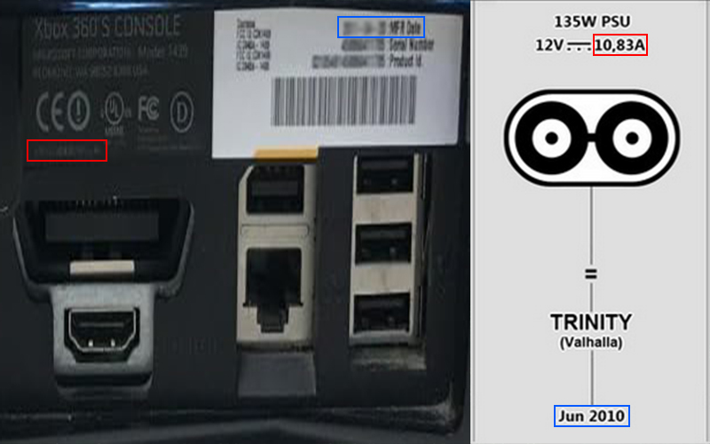
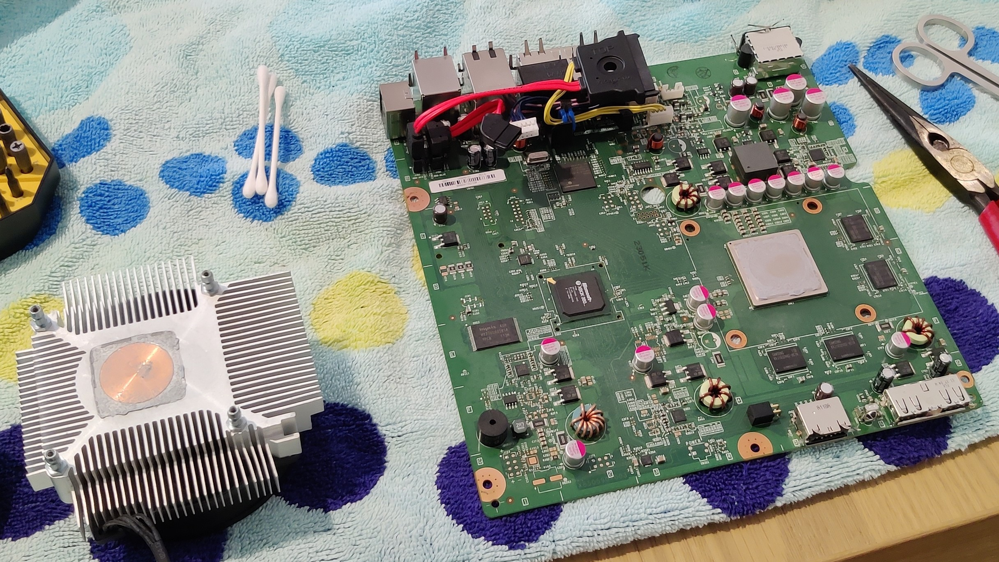
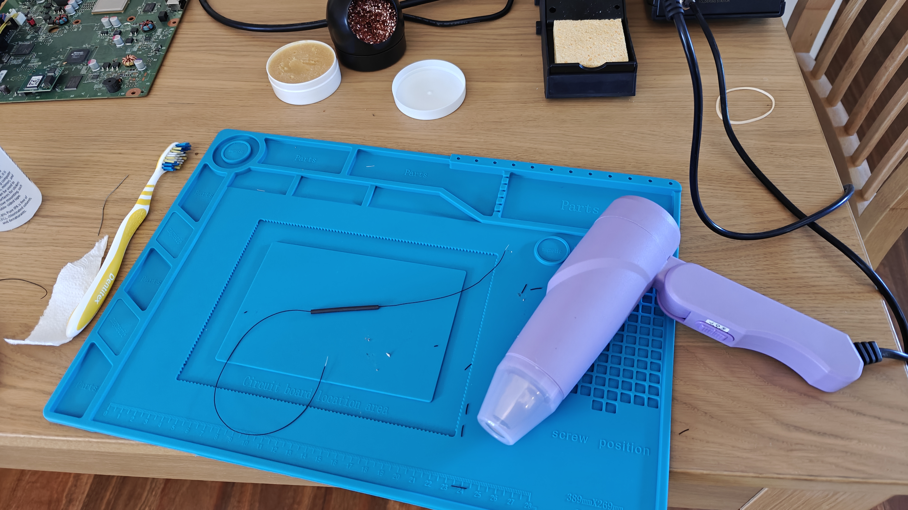
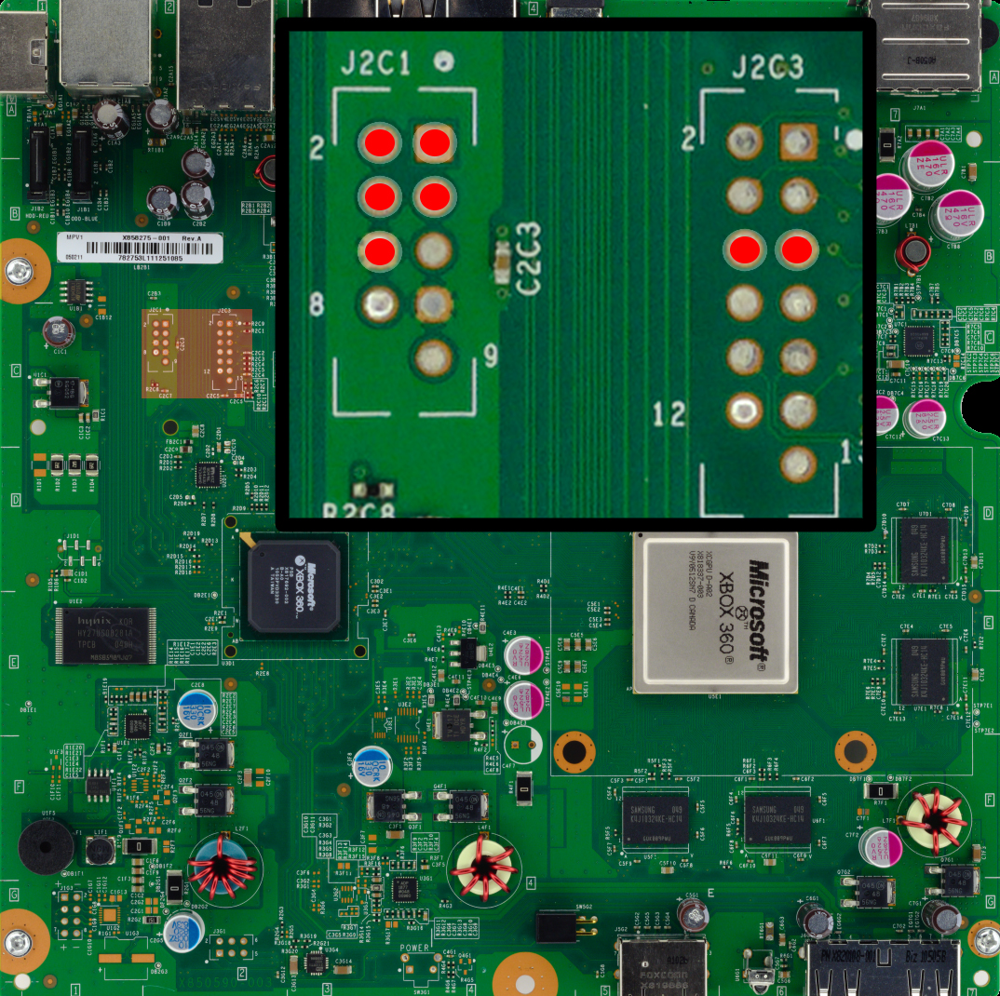
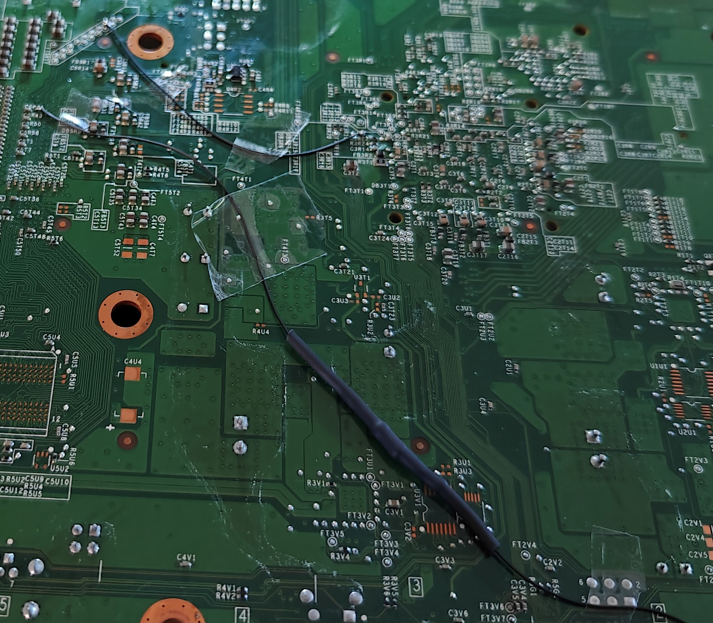
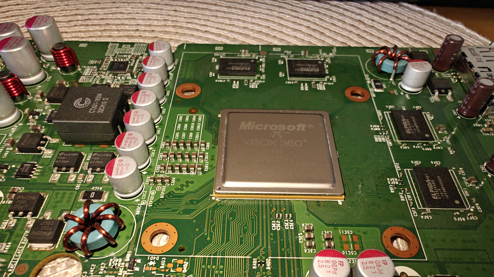
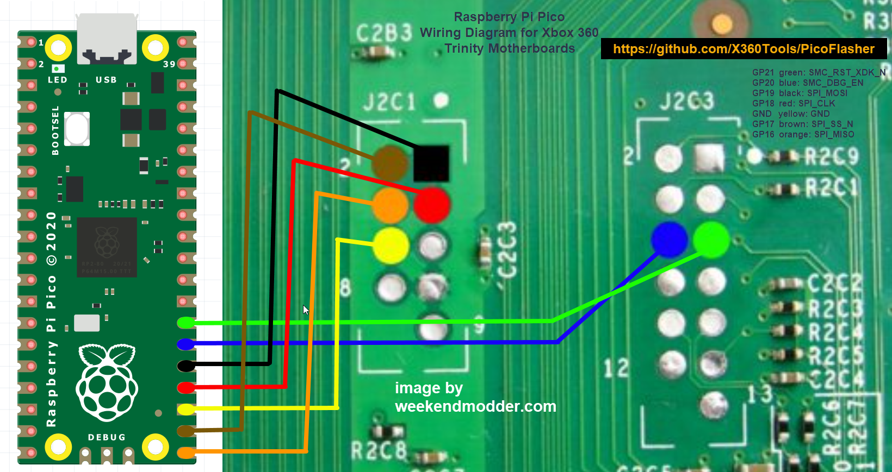

# Mod

## Introduction

This section will guide you step by step through the process of turning your Xbox 360 into a modded console. I've written this guide for people who have a basic level of technological understanding. If you're comfortable navigating menus, finding system information, or using Google for smaller details, you should have no trouble following along.

However, if you're not familiar with basic tech concepts, modding your Xbox 360 might not be the best choice. If something goes wrong, troubleshooting without this foundational knowledge could be frustrating. Having a basic understanding of how your console works will not only make the process smoother but also help you effectively search for solutions when issues arise. Understanding the fundamentals will set you up for success and ensure you enjoy the modding experience.


This guide is written in a step-by-step format, so make sure to follow each step carefully and in order.



I don't recommend performing mods on your main console, as several steps in the guide could overwrite existing data or reset your settings. I only suggest using your main console if you're 100% confident that everything has been properly backed up. There are plenty of consoles available on the used market, such as on Facebook Marketplace or eBay, so I recommend picking up a cheap console to mod while keeping your main console stock with all your original saves, settings, etc., intact.


## Goals

* Play Microsoft Xbox 360 backups from an external HDD and/or internal HDD.
* Play Microsoft Xbox backups from an external HDD and/or internal HDD.


Backups refer to file-level copies of games that you have lawfully purchased and already own, either digitally or on physical media such as a CD, DVD, floppy disk, cartridge, etc.



It is both illegal and unethical to pirate or obtain games that you have not purchased or do not own a legitimate physical or digital copy of. This guide is intended solely to help you modify your console so you can back up and play games you already own. I do not endorse or support any form of software piracy.

By following this guide, you assume full responsibility for your actions. I will not be held liable for any legal issues or consequences that may arise should you choose to engage in piracy or any other illegal activity. Always respect copyright laws and the intellectual property of game developers.


## Console

Microsoft Xbox 360 Slim (Trinity)


This guide is intended exclusively for the Trinity Xbox 360 Slim consoles. **Use the image below** to compare the power supply rating and **manufacture date** of your console. If the power rating matches **12V - 10.83A, 135 watts** and the manufacture date falls between **mid-2010 and early 2011**, you have a **Trinity Xbox 360 Slim**.



## Equipment

You will need:

* Xbox 360 Hard Drive Disk Cover Replacement
* USB flash drive formatted to FAT32.
* Seagate BarraCuda 2.5" Notebook HDD - 2TB 128MB
* 10k Ohm 0.5 Watt Metal Film Resistor
* X-Clamp Removal Tool
* Heat Shrink Tubing
* ARCTIC MX-4 Thermal Compound Paste
* Digital Microscope
* SRA Soldering Products Rosin Paste Flux #135 in a 2 oz Jar
* Seagate 2TB Expansion Portable HDD
* MG Chemicals 99.9% Isopropyl Alcohol
* MG Chemicals Lead Free No Clean Flux 1L
* Soldering Iron
* Solder
* 30AWG Kynar wire
* Raspberry Pi Pico
* Heat Gun
* Screwdriver set with T8/T10
* X-Acto Knife
* Breadboard Jumper Ribbon Cables Kit
* SATA to USB Converter
* Paper Towel
* Computer

## Prerequisites

1. Update your console to the latest version.
2. [Transfer your main profile to a USB drive](https://support.xbox.com/en-AU/help/xbox-360/my-account/manage-gamertag-and-profile/move-your-profile-to-another-console-using-a-flash-drive-or-memory-unit) and keep it safe. This guide won’t cover going online, and even if it did, I don’t recommend using your main profile on the console, as it may risk getting you banned.
3. Format both your **Seagate 2TB Expansion Portable HDD** and **Seagate BarraCuda 2.5" Notebook HDD - 2TB 128MB** using the [**Xbox 360 System Menu**](https://support.xbox.com/en-AU/help/xbox-360/accessories/using-usb-flash-drive).

## Teardown

Tearing down an Xbox 360 Slim can be tricky to explain, so I’ve provided a link to an excellent guide by 7Heavens on the WeMod forum. Their detailed instructions and visuals will help you through the process step by step. Click [here ](https://community.wemod.com/t/how-to-open-a-xbox-360-slim/351)to visit the guide.

<figure><figcaption></figcaption></figure>

## Preparation

### Heatsink and Processor Cleaning

Now that you have fully removed the motherboard and heatsink covering the processor, take the time to clean off the old thermal paste using a paper towel and isopropyl alcohol. Ensure it is thoroughly cleaned, as this will help the new thermal paste bond effectively. This step is crucial for the Xbox 360, as the console tends to run hot.

<figure><figcaption></figcaption></figure>

### Wire and Resistor

1. Grab your 10k Ohm 0.5 Watt Metal Film Resistor and trim each leg to about 2-3 cm on each side. This will make it easier to work with during the installation.
2. Next, take 20 cm of 30AWG Kynar wire and cut it in half. We can always shorten the wires later if needed.
3. Strip a small section off each end of the Kynar wire, then dip the exposed wire ends in flux.
4. Solder one 10 cm piece of Kynar wire to one side of the resistor, and then solder the other 10 cm piece of Kynar wire to the other side.
5. Once you're confident that there are good solder joints holding each piece of wire to the resistor, cover the entire resistor and solder joints with heat shrink tubing to ensure a secure and insulated connection.
6. Use a heat gun to shrink the tube until it gently grips the resistor and wires.

<figure><figcaption></figcaption></figure>

### Prepare NAND Solder Points

For each of the solder points on the console motherboard:

1. Clean the point with isopropyl alcohol.
2. Apply flux to the point.
3. Tin the point with solder.

<figure><figcaption></figcaption></figure>

### Prepare RGH Solder Points

At this stage, we want to start preparing our solder points for the RGH 3 mod. Below is an image of a Trinity Xbox 360 Slim motherboard that highlights each of the points we will be preparing and soldering to.

<figure><figcaption></figcaption></figure>

#### POST

1. Clean the point with isopropyl alcohol.
2. Apply flux to the point.
3. Tin the point with solder.

#### PLL\_BYPASS

1. Clean the point with isopropyl alcohol.&#x20;
2. Using an X-Acto Knife, carefully expose the VIA.


Be extremely cautious not to cut the trace directly below the via. Damaging this trace will render your console inoperable, and you'll need to perform a trace repair, which requires advanced skills and is beyond the scope of this guide.


<figure><figcaption></figcaption></figure>

1. Apply flux to the point.&#x20;
2. Tin the point with solder.

SMC\_POST

1. Clean the point with isopropyl alcohol.
2. Apply flux to the point.
3. Tin the point with solder.

#### SMC\_PLL

1. Clean the point with isopropyl alcohol.
2. Apply flux to the point.
3. Tin the point with solder.

## Soldering RGH Points

Now it’s time to solder! Refer to the image below for guidance on where to make your solder connections. Ensure you have a steady hand and take your time to achieve clean, secure joints for the best results.

1. Join POST and SMC\_POST using a short length of wire, see images below for reference before you begin soldering.
2. Join PLL\_BYPASS and SMC\_PLL using the long length of wire with the resistor, see images below for reference before you begin soldering.&#x20;

<figure><figcaption></figcaption></figure>

<figure><figcaption></figcaption></figure>

## Partial Console Assembly

1. Apply a pea-sized amount of thermal paste to the centre of the processor. This will ensure proper thermal conductivity between the CPU and the heatsink, helping to keep the processor cool during operation.

2. Reattach the four-pin fan connector and position the fan on top of the processor, ensuring that all four posts fit securely through the holes on the motherboard.
3. Flip the motherboard over and reattach the X-clamp using the X-clamp removal tool. Ensure that the oval-shaped hole on the X-clamp is oriented towards the front of the console for proper alignment and secure fastening.
4. Place the motherboard back into the case and reattach the power LED board. Connect the faceplate to the LED board using the ribbon cable, which will allow you to use the power and eject buttons to turn on the console when you reach that step. Ensure all connections are secure for proper functionality.

## NAND Preparation

### Solder NAND Points

Using the diagram below as a reference, connect each coloured wire from your Breadboard Jumper Ribbon Cables Kit to the appropriate pin on the Raspberry Pi Pico. Then, solder the other end of each wire to the corresponding point on the motherboard. Ensure that each connection is secure and properly aligned.

<figure><figcaption></figcaption></figure>

### Downloads

#### J-Runner with extras

1. Download J-Runner with extras [here](https://github.com/Octal450/J-Runner-with-Extras/releases/download/V3.3.0-r3/J-Runner-with-Extras.zip).
2. Extract the archive to a folder.

#### PicoFlasher

1. Download PicoFlasher [here](https://github.com/X360Tools/PicoFlasher/releases/tag/3.0).
2. Extract the archive to a folder.

### Preparing PicoFlasher

1. Hold down the BOOTSEL button on your Raspberry Pi Pico, and while continuing to hold the button, plug it into your computer using a micro USB cable. Keep holding the BOOTSEL button until a drive appears in Windows Explorer. This indicates that the Pico is in bootloader mode and ready for programming.
2. Copy the PicoFlasher.uf2 file from the folder we previously extracted from the PicoFlasher zip archive and paste it into the root of the PicoFlasher drive. Once copied, the Raspberry Pi Pico will reboot automatically, and the drive will disappear from Windows Explorer.
3. Unplug the Raspberry Pi Pico and then plug it back in normally (without holding the BOOTSEL button). The Pico is now ready for the next steps in the process.
4. Plug the power cable into your Xbox 360 console, but **DO NOT TURN IT ON**. This step provides power to the motherboard for the flashing process without fully powering up the system.

## Flashing RGH3 NAND

### NAND Dump

1. Open the JRunner program by launching JRunner.exe.
2. Click **Read Nand** and wait for the process to complete.

<figure><figcaption></figcaption></figure>

### Create XeLL Image

1. Make sure to select **Glitch2**, **RGH3** and then click **Create XeLL**.

<figure><figcaption></figcaption></figure>

3. Once the process has completed, click **Write XeLL**.
4. Once the process is complete, disconnect your Raspberry Pi Pico from your computer.

### CPU Key

1. Connect a monitor or TV to your console.
2. Power on your console.
3. Wait for XeLL Reloaded to initialise on your Xbox 360. Once it has loaded, console details such as the CPU key and other system information will be displayed on the screen.
4. Take note of your CPU key displayed on the screen and carefully enter it into J-Runner. Make sure it is an exact match, as an incorrect CPU key can cause issues with the modding process and potentially brick your console. Double-check each character to avoid any errors.

<figure><figcaption></figcaption></figure>

5. Once the check has completed, you can power off your Xbox 360 console while ensuring it remains plugged into power.

### Flash RGH NAND

1. Connect your Raspberry Pi Pico back to the computer using the micro USB cable.
2. Click **Create XeBuild**.

<figure><figcaption></figcaption></figure>

3. Once the process has completed, click **Write Nand**.
4. Wait for the process to complete successfully.&#x20;
5. Test that the flashing worked by pressing the eject button on your Xbox 360 console. If the flashing was successful, you should see the console boot into XeLL Reloaded.

### NAND Dump Backup

Navigate to the directory shown in your J-Runner where all the NAND dump files are stored. It’s important to back these files up to a safe location, such as cloud storage, as you’ll need them if you ever want to return the console to its original stock state. Ensuring these backups are secure will help you avoid any potential issues in the future.

<figure><figcaption></figcaption></figure>

## Cleanup

Now that we’ve confirmed the console has been successfully RGH3 modded, we can proceed with the cleanup stage. Once that’s complete, we’ll move on to adding homebrew applications and games.

1. Power off the console.
2. Desolder each of the Breadboard Jumper wires from the NAND points on the top of the console's motherboard. Take your time to ensure that you do not damage any of the surrounding pads during the desoldering process. Once all wires are removed, inspect the area for any solder bridges or debris before moving on.
3. Reassemble the console completely. I’ve provided a link to an excellent guide by 7Heavens on the WeMod forum. Their detailed instructions and visuals will help you through the process step by step. Click [here ](https://community.wemod.com/t/how-to-open-a-xbox-360-slim/351)to visit the guide.

## Homebrew

### Preparation

1. Power on your console and insert a blank USB drive.
2. Using the Xbox 360 system menu go ahead and [format your USB drive](https://support.xbox.com/en-AU/help/xbox-360/accessories/using-usb-flash-drive) which we will use to transfer files to the console.
3. Disconnect the USB drive from the console and insert into your computer.
4. Download [XEXMenu ](https://download.digiex.net/Consoles/Xbox360/Jtag/xexmenu\_v1.1.rar)and extract the archive to a folder.
5. Download [DashLaunch ](https://consolemods.org/wiki/File:Dash\_launch\_v3.21.zip)and extract the archive to a folder.
6. Download [Aurora ](http://phoenix.xboxunity.net/downloads/Aurora%200.7b.2%20-%20Release%20Package.rar)and extract the archive to a folder.
7. Rename the extracted Aurora folder to 'Aurora'.
8. Copy the **Aurora** folder to the root of your USB drive.
9. Open the extracted DashLaunch folder and rename the folder called 'Installer' to 'DashLaunch'.
10. Copy the **DashLaunch** and **XellLaunch** folders to the root of your USB drive.
11. Open the extracted XEXMenu folder and extract the two archives 'XexMenu-LIVE.rar' and 'XexMenu-XEX.rar' to seperate folders.
12. Copy the **XexMenu-XEX** folder to the root of your USB drive.
13. Make sure that in your Windows folder view settings, the **Show hidden items** option is ticked. This will allow you to see the hidden **Content** folder on the root of your USB drive. We will be adding files to this folder in the next steps, so ensure it’s visible.
14. Create a new folder inside the **Content** folder called **0000000000000000**.
15. Open the extracted **XexMenu-LIVE** folder from before and copy the **CODE9999** folder to the **0000000000000000** folder.
16. Disconnect your USB drive from your computer.

### Transferring files to console

1. Power on your console and insert the USB drive.
2. Using the Xbox 360 System Menu, locate the **Demos** folder on your USB drive and **copy** the **XeXMenu Game Demo** to your **internal HDD**.
3. Exit back to the dashboard and open **Games ->** **My Games**.
4. Launch **XeXMenu**.
5. Press the **RB** button on your controller.
6. Make sure that **Aurora** is higlighted and press **Y** button and then **COPY**.
7. Press the **right** button on your **D-pad** until **HDD1** is showing on the right hand side of the screen.&#x20;
8. Press the **Y** button on your controller and select **Create**.
9. Name the folder **Apps** and press **Done**.
10. Open the **Apps** folder, press the **Y** button and then **Paste**.
11. Press the **left** button on your **D-pad** until **USB0** is showing on the right hand side of the screen.
12. Make sure that **DashLaunch** is highlighted and press **Y** button and then **COPY.**
13. Press the **right** button on your **D-pad** until **HDD1** is showing on the right hand side of the screen.
14. Open the **Apps** folder, press the **Y** button and then **Paste**.
15. Press the **left** button on your **D-pad** until **USB0** is showing on the right hand side of the screen.
16. Make sure that **XellLaunch** is highlighted and press **Y** button and then **COPY.**
17. Press the **right** button on your **D-pad** until **HDD1** is showing on the right hand side of the screen.
18. Open the **Apps** folder, press the **Y** button and then **Paste**.
19. Press the **left** button on your **D-pad** until **USB0** is showing on the right hand side of the screen.
20. Make sure that **XexMenu** is highlighted and press **Y** button and then **COPY.**
21. Press the **right** button on your **D-pad** until **HDD1** is showing on the right hand side of the screen.
22. Open the **Apps** folder, press the **Y** button and then **Paste**.

### DashLaunch

#### Set Aurora Dashboard to auto boot

1. Disconnect your USB drive from the console.
2. Open the **Apps** folder and then **DashLaunch** folder.
3. Launch **default.xex**.
4. Navigate to **Paths** and select **Default**.
5. Press the **Y** button.
6. With **Default** still selected, press the **A** button.
7. Navigate to **HDD: -> Apps -> Aurora**.
8. Select **Aurora.xex** and press the **A** button.
9. Press the **RB** button, highlight **HDD** and press the **X** button.
10. Press the **B** button to exit DashLaunch.

### Aurora Dashboard

#### Settings

1. Press the **Start** button on your controller to open settings.
2. Go to **Content** and enable **AutoScan** next to **Title Updates**.
3. Exit the settings menu.

#### Scripts

1. Press the **Back** button on your controller.
2. Navigate to **Scripts**.
3. Open **Aurora Repo Browser**.
4. Open Utility Scripts and press the **A** button on **Xbox 360 Homebrew Store**.
5. Open Utility Scripts and press the **A** button on **Xefu Spoofer**.
6. Exit the settings menu.

#### Content Scanning

1. Press the **Start** button on your controller to open settings.
2. Go to **Content.**

Setup the following scan paths:

<table><thead><tr><th>Content</th><th width="292">Path</th><th>Scan Depth</th></tr></thead><tbody><tr><td>Xbox 360 Games</td><td>\Xbox360\System\HDD1\Content</td><td>4</td></tr><tr><td>Scripts</td><td>Xbox360\System\HDD1\Apps</td><td>2</td></tr><tr><td>Xbox Games</td><td>box360\System\USB0\</td><td>MAX</td></tr></tbody></table>

### Xbox Compatibility Fix

1. Download [HDD Compatibility Partition Fixer](https://consolemods.org/wiki/File:Hdd\_compat\_partition\_fixer\_v1.zip).
2. Extract the archive to a folder.
3. Download the [Hacked Compatibility Files](https://consolemods.org/wiki/File:Xb1\_5832\_apr\_2018-hacked\_xgamechat\_fix.zip).
4. Extract the archive to a folder.
5. Insert a blank USB drive and make sure that it's FAT32 format.
6. Copy the HDD Compatibility Partition Fixer folder and Hacked Compatibility Files folder to the root of your USB drive.
7. Insert the USB drive into your Xbox 360 console.
8. On the Aurora Dashboard, press the Xbox button on your controller.
9. Open the file browser.
10. Open the **hdd\_compat\_partition\_fixer** folder.
11. Launch default.xex.

<figure><figcaption></figcaption></figure>

12. Press the A button on your controller to continue.

<figure><figcaption></figcaption></figure>

13. Once the process has completed successfully, you can press the B button to exit.

<figure><figcaption></figcaption></figure>

13. Reboot your console.
14. In the Aurora Dashboard, press the back button on your controller.
15. Open File Manager.
16. Locate the following folder on your USB drive **hacked\_xgamechat\_fix** -> **HUD\_xgamechat**.
17. Copy the **Compatibility** folder and paste it in **HddX**.
18. Reboot your console.

## Games

### Xbox 360


Xbox 360 game backups must be converted from **.iso** to **GOD** format.


#### Preparation

1. Download [Iso2God](https://github.com/r4dius/Iso2God/releases/download/1.3.7/iso2god-v1.3.7.zip).
2. Launch Iso2God.
3. Add your Xbox 360 game backups in .iso format.
4. Make sure the padding settings match below.

<figure><figcaption></figcaption></figure>

5. Click convert and wait for the process to complete.

#### Transferring Games

1. Download [FATXplorer](https://api.eaton-works.com/download/FATXplorer/FATXplorer64.zip).
2. Connect your Xbox 360 Internal HDD to your computer using a SATA to USB converter.
3. Run FATXplorer and select the **Devices** tab and click **Integrate into Windows**.

<figure><figcaption></figcaption></figure>

4. Select the **Content Partition** and click **Done**.

<figure><figcaption></figcaption></figure>

4. Copy each game folder to the **0000000000000000** folder on the drive.


Some multi-disc games require specific processes to get them to work. I recommend checking out [this forum post](https://www.se7ensins.com/forums/threads/a-short-guide-for-installing-multi-disc-games-on-a-jtag-rgh-r-jtag.1381808/) and following the instructions specific to the type of multi-disc game you want to install.


#### Title Updates

For each Xbox 360 game on Aurora Dashboard:

1. Select the game and press Y.
2. Select the title updates tab as seen below:

<figure><figcaption></figcaption></figure>

3. Press the RB button on your controller, select the latest title update and then press A to download.

<figure><figcaption></figcaption></figure>

4. Once the title update has been installed, press LB on your controller.
5. Select the latest title update and press the A button on your controller to enable it.

<figure><figcaption></figcaption></figure>

6. Repeat this process for every game in your collection.

### Xbox


Xbox game backups must be converted from **.iso** to **XBE (folder)** format.


#### Preparation

1. Download [extract-xiso](https://github.com/XboxDev/extract-xiso) and [batch-xiso-extract](https://github.com/IronRingX/batch-xiso-extract).
2. Create a folder on your computer called **Xbox ISO**.
3. Copy the **extract-xiso** and **batch-xiso-extract** scripts to the **Xbox ISO** folder.
4. Copy your Xbox Game Backups in .iso format to the Xbox ISO folder.
5. Run batch-xiso-extract.bat. Each XISO will be extracted into its own directory.

#### Transferring Games

1. Download [FATXplorer](https://api.eaton-works.com/download/FATXplorer/FATXplorer64.zip).
2. Connect your 2TB External HDD to your computer using a SATA to USB converter.
3. Run FATXplorer and select the **Windows Explorer** option and **Content Partition**.
4. Create a folder on the drive called **Games**.
5. Copy each game folder to the **Games** folder on the drive.

## DLC and XBLA

### Xbox 360


Please be advised that the DLC (Downloadable Content) must match the region of your game backup in order to function properly. If the regions do not match, the DLC may not be recognised or compatible with your game. Ensure that both the game and DLC are from the same region to avoid any issues.


#### Installing DLC and XBLA

1. Connect your Xbox 360 Internal HDD to your computer using SATA to USB converter.
2. Run FATXplorer and select the **Devices** tab and click **Integrate into Windows**.

<figure><figcaption></figcaption></figure>

3. Select the **Content Partition** and click **Done**.

<figure><figcaption></figcaption></figure>

4. Download [Xbox 360 Content Manager](https://digiex.net/threads/xbox-360-content-manager-v3-0-download-jtag-rgh-content.10225/).
5. Use Xbox 360 Content Manger to transfer your DLC and XBLA to the Xbox 360 Internal HDD via FTP.

#### Unlocking DLC and XBLA

1. Download [XM360](https://consolemods.org/wiki/File:XM360.7z).
2. Extract the archive to a folder.
3. Insert a blank USB drive into your console.
4. Use the Xbox 360 System Menu to format the USB drive.
5. Insert your USB drive into your computer.
6. Copy the XM360 folder to the root of your USB drive.
7. Insert your USB drive into your console.
8. Using the Aurora file browser, copy the XM360 folder to HDD1 -> Apps.
9. Exit back to the Aurora dashboard.
10. Launch XM360 from the Aurora dashboard.
11. Once XM360 has loaded, select **Scan All** and press the **A** button on your controller.
12. Once the scan has finished, you should see all your XBLA content in the list.
13. Select **Unlock XBLA** and press the **A** button on your controller.
14. Select **Show DLC** and press the **A** button on your controller.
15. Once the scan has finished, you should see all your DLC content in the list.
16. Select **Unlock DLC** and press the **A** button on your controller.
17. Exit XM360.

## Credits

Below are some of the key individuals and teams who deserve special recognition for their efforts in making tools, mods, and resources available to the Xbox 360 community.

| Product | Creator |
| ------- | ------- |
|         |         |
|         |         |
|         |         |
