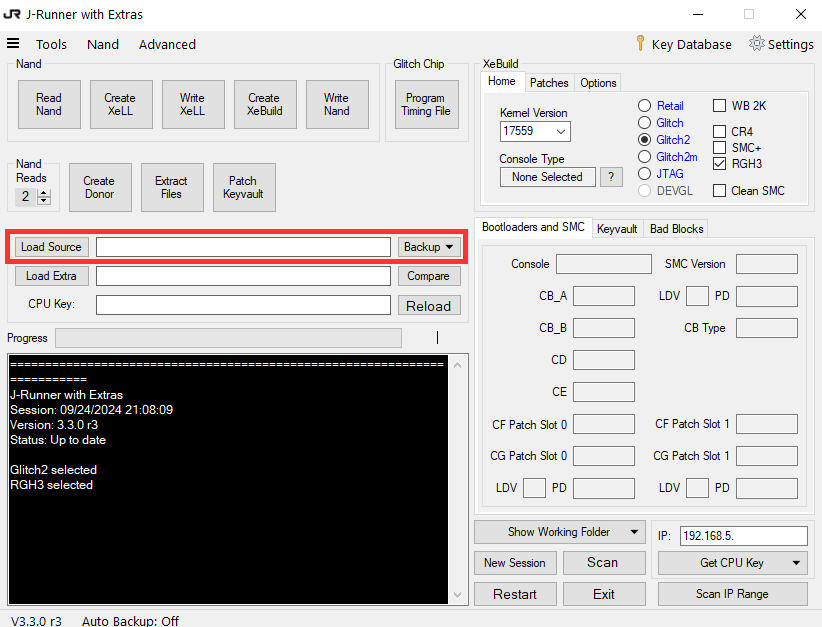

# Mod

## Introduction

This section will guide you step by step through the process of turning your Xbox 360 into a modded console. I've written this guide for people who have a basic level of technological understanding. If you're comfortable navigating menus, finding system information, or using Google for smaller details, you should have no trouble following along.

However, if you're not familiar with basic tech concepts, modding your Xbox 360 might not be the best choice. If something goes wrong, troubleshooting without this foundational knowledge could be frustrating. Having a basic understanding of how your console works will not only make the process smoother but also help you effectively search for solutions when issues arise. Understanding the fundamentals will set you up for success and ensure you enjoy the modding experience.


This guide is written in a step-by-step format, so make sure to follow each step carefully and in order.


## Goals

* Play Microsoft Xbox 360 backups from an external HDD and/or internal HDD.
* Play Microsoft Xbox backups from an external HDD and/or internal HDD.


Backups refer to file-level copies of games that you have lawfully purchased and already own, either digitally or on physical media such as a CD, DVD, floppy disk, cartridge, etc.



It is both illegal and unethical to pirate or obtain games that you have not purchased or do not own a legitimate physical or digital copy of. This guide is intended solely to help you modify your console so you can back up and play games you already own. I do not endorse or support any form of software piracy.

By following this guide, you assume full responsibility for your actions. I will not be held liable for any legal issues or consequences that may arise should you choose to engage in piracy or any other illegal activity. Always respect copyright laws and the intellectual property of game developers.


## Equipment

You will need:

* Microsoft Xbox 360 Slim (Trinity)


This guide is intended exclusively for the Trinity Xbox 360 Slim consoles. **Use the image below** to compare the power supply rating and **manufacture date** of your console. If the power rating matches **12V - 10.83A, 135 watts** and the manufacture date falls between **mid-2010 and early 2011**, you have a **Trinity Xbox 360 Slim**.



* Xbox 360 Hard Drive Disk Cover Replacement
* Seagate BarraCuda 2.5" Notebook HDD - 2TB 128MB
* 10k Ohm 0.5 Watt Metal Film Resistor
* X-Clamp Removal Tool
* Heat Shrink Tubing
* ARCTIC MX-4 Thermal Compound Paste
* Digital Microscope
* SRA Soldering Products Rosin Paste Flux #135 in a 2 oz Jar
* Seagate 2TB Expansion Portable HDD
* MG Chemicals 99.9% Isopropyl Alcohol
* MG Chemicals Lead Free No Clean Flux 1L
* Soldering Iron
* Solder
* 30AWG Kynar wire
* Raspberry Pi Pico
* Heat Gun
* Screwdriver set with T8/T10
* X-Acto Knife
* Breadboard Jumper Ribbon Cables Kit
* Paper Towel
* Computer

## Prerequisites

1. Update your console to the latest version.
2. Transfer your main profile to a USB drive and keep it safe. This guide won’t cover going online, and even if it did, I don’t recommend using your main profile on the console, as it may risk getting you banned.

## Teardown

Tearing down an Xbox 360 Slim can be tricky to explain in writing, so I’ve provided a link to an excellent guide by 7Heavens on the WeMod forum. Their detailed instructions and visuals will help you through the process step by step. Click [here ](https://community.wemod.com/t/how-to-open-a-xbox-360-slim/351)to visit the guide.

<figure><figcaption></figcaption></figure>

## Preparation

### Heatsink and Processor Cleaning

Now that you have fully removed the motherboard and heatsink covering the processor, take the time to clean off the old thermal paste using a paper towel and isopropyl alcohol. Ensure it is thoroughly cleaned, as this will help the new thermal paste bond effectively. This step is crucial for the Xbox 360, as the console tends to run hot.

<figure><figcaption></figcaption></figure>

### Wire and Resistor

1. Grab your 10k Ohm 0.5 Watt Metal Film Resistor and trim each leg to about 2-3 cm on each side. This will make it easier to work with during the installation.
2. Next, take 20 cm of 30AWG Kynar wire and cut it in half. We can always shorten the wires later if needed.
3. Strip a small section off each end of the Kynar wire, then dip the exposed wire ends in flux.
4. Solder one 10 cm piece of Kynar wire to one side of the resistor, and then solder the other 10 cm piece of Kynar wire to the other side.
5. Once you're confident that there are good solder joints holding each piece of wire to the resistor, cover the entire resistor and solder joints with heat shrink tubing to ensure a secure and insulated connection.

<figure><figcaption></figcaption></figure>

### Prepare NAND Solder Points

\* **INSERT IMAGE HERE**&#x20;

For each of the solder points on the console motherboard:

1. Clean the point with isopropyl alcohol.
2. Apply flux to the point.
3. Tin the point with solder.

### Prepare RGH Solder Points

At this stage, we want to start preparing our solder points for the RGH 3 mod. Below is an image of a Trinity Xbox 360 Slim motherboard that highlights each of the points we will be preparing and soldering to.

<figure><figcaption></figcaption></figure>

#### POST

1. Clean the point with isopropyl alcohol.
2. Apply flux to the point.
3. Tin the point with solder.

#### PLL\_BYPASS

1. Clean the point with isopropyl alcohol.&#x20;
2. Using an X-Acto Knife, carefully expose the VIA.

<figure><figcaption></figcaption></figure>

1. Apply flux to the point.&#x20;
2. Tin the point with solder.

SMC\_POST

1. Clean the point with isopropyl alcohol.
2. Apply flux to the point.
3. Tin the point with solder.

#### SMC\_PLL

1. Clean the point with isopropyl alcohol.
2. Apply flux to the point.
3. Tin the point with solder.

## Soldering RGH Points

Now it’s time to solder! Refer to the image below for guidance on where to make your solder connections. Ensure you have a steady hand and take your time to achieve clean, secure joints for the best results.

<figure><figcaption></figcaption></figure>

<figure><figcaption></figcaption></figure>

## Partial Console Assembly

1. Apply a pea-sized amount of thermal paste to the centre of the processor. This will ensure proper thermal conductivity between the CPU and the heatsink, helping to keep the processor cool during operation.

2. Reattach the four-pin fan connector and position the fan on top of the processor, ensuring that all four posts fit securely through the holes on the motherboard.
3. Flip the motherboard over and reattach the X-clamp using the X-clamp removal tool. Ensure that the oval-shaped hole on the X-clamp is oriented towards the front of the console for proper alignment and secure fastening.
4. Place the motherboard back into the case and reattach the power LED board. Connect the faceplate to the LED board using the ribbon cable, which will allow you to use the power and eject buttons to turn on the console when you reach that step. Ensure all connections are secure for proper functionality.

## NAND Preparation

### Solder NAND Points

Using the diagram below as a reference, connect each coloured wire from your Breadboard Jumper Ribbon Cables Kit to the appropriate pin on the Raspberry Pi Pico. Then, solder the other end of each wire to the corresponding point on the motherboard. Ensure that each connection is secure and properly aligned.

<figure><figcaption></figcaption></figure>

### Downloads

#### J-Runner with extras

1. Download J-Runner with extras [here](https://github.com/Octal450/J-Runner-with-Extras/releases/download/V3.3.0-r3/J-Runner-with-Extras.zip).
2. Extract the archive to a folder.

#### PicoFlasher

1. Download PicoFlasher [here](https://github.com/X360Tools/PicoFlasher/releases/tag/3.0).
2. Extract the archive to a folder.

### Preparing PicoFlasher

1. Hold down the BOOTSEL button on your Raspberry Pi Pico, and while continuing to hold the button, plug it into your computer using a micro USB cable. Keep holding the BOOTSEL button until a drive appears in Windows Explorer. This indicates that the Pico is in bootloader mode and ready for programming.
2. Copy the PicoFlasher.uf2 file from the folder we previously extracted from the PicoFlasher zip archive and paste it into the root of the PicoFlasher drive. Once copied, the Raspberry Pi Pico will reboot automatically, and the drive will disappear from Windows Explorer.
3. Unplug the Raspberry Pi Pico and then plug it back in normally (without holding the BOOTSEL button). The Pico is now ready for the next steps in the process.
4. Plug the power cable into your Xbox 360 console, but **DO NOT TURN IT ON**. This step provides power to the motherboard for the flashing process without fully powering up the system.

## Flashing RGH3 NAND

### NAND Dump

1. Open the JRunner program by launching JRunner.exe.
2. Click **Read Nand** and wait for the process to complete.

<figure><figcaption></figcaption></figure>

### Create XeLL Image

1. Make sure to select **Glitch2**, **RGH3** and then click **Create XeLL**.

<figure><figcaption></figcaption></figure>

3. Once the process has completed, click **Write XeLL**.
4. Once the process is complete, disconnect your Raspberry Pi Pico from your computer.

### CPU Key

1. Connect a monitor or TV to your console.
2. Power on your console.
3. Wait for XeLL Reloaded to initialise on your Xbox 360. Once it has loaded, console details such as the CPU key and other system information will be displayed on the screen.
4. Take note of your CPU key displayed on the screen and carefully enter it into J-Runner. Make sure it is an exact match, as an incorrect CPU key can cause issues with the modding process and potentially brick your console. Double-check each character to avoid any errors.

<figure><figcaption></figcaption></figure>

5. Once the check has completed, you can power off your Xbox 360 console while ensuring it remains plugged into power.

### Flash RGH NAND

1. Connect your Raspberry Pi Pico back to the computer using the micro USB cable.
2. Click **Create XeBuild**.

<figure><figcaption></figcaption></figure>

3. Once the process has completed, click **Write Nand**.

## Aurora Dashboard

## Games

### Xbox 360

### Xbox

## DLC

### Xbox 360

## Credits

Below are some of the key individuals and teams who deserve special recognition for their efforts in making tools, mods, and resources available to the Xbox 360 community.

| Product | Creator |
| ------- | ------- |
|         |         |
|         |         |
|         |         |

